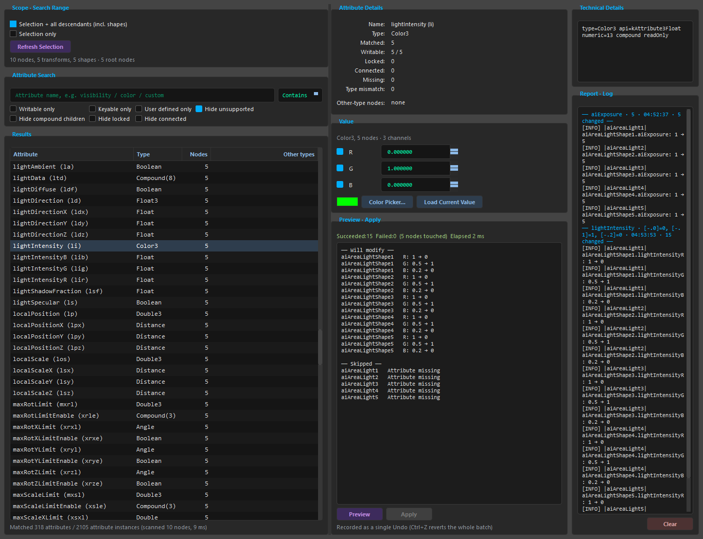

**English** | [中文](README.zh.md)

# Batch Attribute Editor

> A **batch attribute discovery & editing system** for Maya: recursively find nodes (including
> shapes) inside the selected hierarchy, search attributes by name, resolve the real Maya types,
> generate a matching editor for each type, safely skip
> Locked / Connected / Missing / type-incompatible attributes, complete the batch edit with a
> single Apply, and make the whole batch take **only one Undo**.

Target environment: **Maya 2024 / 2024.2** (Python 3.10, Maya API 2.0, PySide2 5.15.2 or PySide6).
Every API behaviour described in this document was measured on this machine with `mayapy`; for the
evidence see [`docs/ARCHITECTURE.md`](docs/ARCHITECTURE.md).

<p align="center">
  
</p>
<p align="center"><em>Batch Attribute Editor: scope / search / results (left), attribute details,
value editor and preview (middle), technical inspector and operation audit log (right).</em></p>

---

## What it solves

Maya's native Attribute Editor only ever targets the current single node, the Channel Box can only
display a limited set of attributes, and neither can "search attributes by name across a whole
hierarchy and edit them in bulk". This tool fills that gap:

```
Select node → recursive traversal (incl. Shape / Intermediate Shape) → search by attribute name
→ resolve the real type → generate the editor for that type → preview what will change / what will be skipped → batch write → one Undo
```

It is not `for node in nodes: cmds.setAttr(...)`; the core capabilities are:

```
Hierarchy Traversal + Attribute Discovery + Type Resolution
+ Compatibility Validation + Type-aware Editing + Batch Apply + Undo/Redo
```

---

## Quick start

Run this in Maya's **Script Editor** (Python tab):

```python
import sys
sys.path.insert(0, r"C:\opencode\BatchAttributeEditor")
import main
main.launch()
```

Then:

1. Select one (or several) nodes in the viewport — for example a `Character_GRP`;
2. Type `visibility` into **Attribute Search**;
3. Click the `visibility   Boolean   182` row in **Results**;
4. Untick the checkbox in **Value** (set it to `False`);
5. Click **Preview** — you will see "175 nodes will be modified, 7 skipped, of which 5 Locked and 2 Connected";
6. Click **Apply**;
7. Press `Ctrl+Z` once — all 175 nodes are restored.

For installation (shelf button, copying into the scripts directory, loading automatically with Maya)
see [`docs/INSTALL.md`](docs/INSTALL.md); for the full feature reference see
[`docs/USAGE.md`](docs/USAGE.md).

---

## Supported types

| Type | Editor | Notes |
| --- | --- | --- |
| Float / Double | Numeric input | Honours the hard range declared by Maya |
| Integer | Integer input | Strict integer validation, never silently rounds |
| Boolean | Checkbox | |
| String | Text input | Never treated as a number |
| Enum | Drop-down | Shows the enum names, writes Maya's enum index internally |
| Angle / Distance / Time | Numeric input + unit hint | Uses Maya's working units (degrees / centimetres / frames) |
| Float3 / Double3 | Three X / Y / Z channels | Each channel can be ticked independently |
| Color3 | R / G / B + Color Picker… | Does not clamp to 0-1 on its own |
| Compound | Per-child editing | Addressed through the `plug.child(i)` index, never by concatenating names |
| Multi (array) | One row per element that exists | The first version only edits elements that already exist |
| Matrix / Message | Recognition and inspection only | Does not pretend to support editing |

---

## Safety policy

Non-destructive by default. The following actions **never** happen automatically:

* unlocking (`unlock`)
* disconnecting (`disconnect`)
* creating / deleting attributes or array elements
* implicit type conversion (for example writing a float attribute as an int, or treating a String as a number)
* deleting / renaming nodes

Targets that are locked, connected, missing the attribute, or type-mismatched are **skipped with a
reason**, listed one by one in the Preview and the Report, while the technical details (exception
type, plug name) are kept in the log.

---

## Project layout

```
BatchAttributeEditor/      ← add this directory to sys.path
    __init__.py            optional facade: injects sys.path and forwards to main
    bootstrap.py           sys.path injection and same-name module conflict handling
    main.py                entry point: launch() / close() / __version__
    core/                  Qt-independent, fully testable under mayapy
        types.py           type data model (AttributeKind / ChannelSpec / AttributeDefinition)
        type_resolver.py   real type resolution (MObject + MFn* metadata)
        selection.py       selection resolution and de-duplication
        traversal.py       DAG traversal (incl. Shape / Intermediate)
        attributes.py      attribute enumeration and type identification
        compatibility.py   Locked / Connected / Missing / type compatibility validation
        search.py          search, matching, aggregation by (name, type)
        batch_setter.py    preview and batch writing
        undo.py            Undo Chunk management
        cache.py           scan cache
        results.py         preview / apply result dataclasses
        session.py         Core facade (the UI talks only to this)
    ui/                    reaches Maya only through Core
        qt.py              PySide6 / PySide2 compatibility layer
        panels.py          Scope / Attribute Search / Results / Attribute Details / Value / Preview / Report sections
        attribute_model.py results table model
        editors/           editors generated on the fly from the attribute type (ValueEditorFactory)
        main_window.py     window orchestration
    utils/
        maya_utils.py      node/plug name derivation, UUID re-checks
        logging_utils.py   two-channel logging (user-readable / technical detail)
    tests/                 136 tests (run under mayapy)
    tools/selfcheck.py     self-check script that runs inside a real Maya
    docs/                  documentation (install / usage / architecture / limitations)
```

The price of the flat layout is that top-level names such as `core` / `ui` / `utils` / `tests` are
very common and may collide with other plug-ins using the same layout (for example the sibling
`materialConvert` tool). At launch the tool therefore:

* puts its own root **first** on `sys.path` so its packages win the lookup;
* evicts foreign modules with the same top-level names — **including cached submodules** such as a
  stale `core.results` left by the other tool, which would otherwise shadow this tool's imports;
* prints a notice whenever such a take-over happens.

The result is a "last launched tool wins" contract that works in both directions: the other tool's
open window keeps running from its already-imported modules, and both tools can be used in the same
Maya session. Use `main.launch(release_conflicts=False)` to skip the take-over.

---

## Tests

The Core layer and part of the UI layer can be fully automated under Maya's bundled `mayapy` (run
from the project root):

```powershell
& "C:\Program Files\Autodesk\Maya2024\bin\mayapy.exe" tests\run_tests.py
```

To run a single module:

```powershell
& "C:\Program Files\Autodesk\Maya2024\bin\mayapy.exe" tests\run_tests.py -k undo
```

Current result: **all 136 tests pass** (of which the 12 widget tests that need a real GUI are skipped
in batch mode).

| Test file | Coverage |
| --- | --- |
| `test_traversal.py` | Single transform, transform + shape, intermediate shape, multiple roots, de-duplication, a 5-level deep hierarchy, DG nodes |
| `test_type_resolution.py` | Float / Int / Bool / String / Enum / Angle / Distance / Time / Float3 / Double3 / Color3 / Compound / Multi / User Defined / Matrix / missing attributes / hard range |
| `test_search.py` | Full / partial / long and short names / case sensitivity / fuzzy matching, aggregation, splitting same-name-different-type entries |
| `test_compatibility.py` | Locked, Connected (incl. a writable connection source and connected compound children), Missing, type mismatch, deleted node, renamed node |
| `test_batch_setter.py` | Batch writing per type, colours not clamped, multi does not create new elements, missing/locked/connected skips, one failing node does not abort the batch, same name with different types only edits compatible nodes |
| `test_undo.py` | One Apply = one Undo, Redo, still one Undo after a partial failure, still one Undo with 150 nodes, a control group proving the chunk is necessary |
| `test_session.py` | End-to-end workflow, self-consistent preview statistics, cache and refresh, 1500+ node performance |
| `test_ui_smoke.py` | UI module imports, factory registry completeness, results table model; the widget tests run in a GUI session |

To run one end-to-end self-check inside a real Maya GUI (it creates temporary nodes and deletes them
again when done):

```python
import sys
sys.path.insert(0, r"C:\opencode\BatchAttributeEditor")
import tools.selfcheck
tools.selfcheck.run(create_test_nodes=True)
```

---

## Verification status (an honest account)

| Area | Status |
| --- | --- |
| Core (traversal / type resolution / validation / search / writing / Undo) | ✅ 136 tests pass under Maya 2024.2 mayapy |
| Undo granularity (one Apply = one Undo) | ✅ verified by measurement (including a 150-node batch and partial-failure scenarios) |
| UI module import and factory dispatch | ✅ verified automatically |
| **UI window construction and display** | ✅ confirmed in a real Maya 2024.2 GUI (`tools/selfcheck.py`, PySide2 5.15.2) |
| **UI interaction details** (button clicks, colour picker, dock dragging) | ⚠️ not covered by automation, needs manual confirmation |

The process and results of confirming window construction and display are documented in section 1 of
[`docs/LIMITATIONS.md`](docs/LIMITATIONS.md).
The self-check builds the window, runs the complete workflow on temporary nodes (including "the whole
batch write takes only one Undo"), and finally deletes the temporary nodes.

---

## Known limitations summary

* The first version does not create / delete array elements; it only edits elements that **already exist**;
* No destructive options such as "force unlock" or "force disconnect" are provided;
* Types such as Matrix / Message are only recognised, not edited;
* By default only DAG descendants are traversed, not the whole Dependency Graph (the extension point
  exists but is not enabled);
* Colour management fails to initialise on this machine, so `cmds.addAttr(attributeType="float3")`
  fails silently — this is an **environment problem** and does not affect the tool (Color3 is tested
  with real colour attributes such as `overrideColorRGB` and `lambert.color`).

For the complete list see [`docs/LIMITATIONS.md`](docs/LIMITATIONS.md).

---

## Documentation

| File | Contents |
| --- | --- |
| [`docs/ARCHITECTURE.md`](docs/ARCHITECTURE.md) | Module responsibilities, data flow, API strategy, Undo strategy, measured evidence |
| [`docs/INSTALL.md`](docs/INSTALL.md) | Installation, verification, uninstallation |
| [`docs/USAGE.md`](docs/USAGE.md) | Interface and workflow reference |
| [`docs/LIMITATIONS.md`](docs/LIMITATIONS.md) | Known limitations and caveats |
